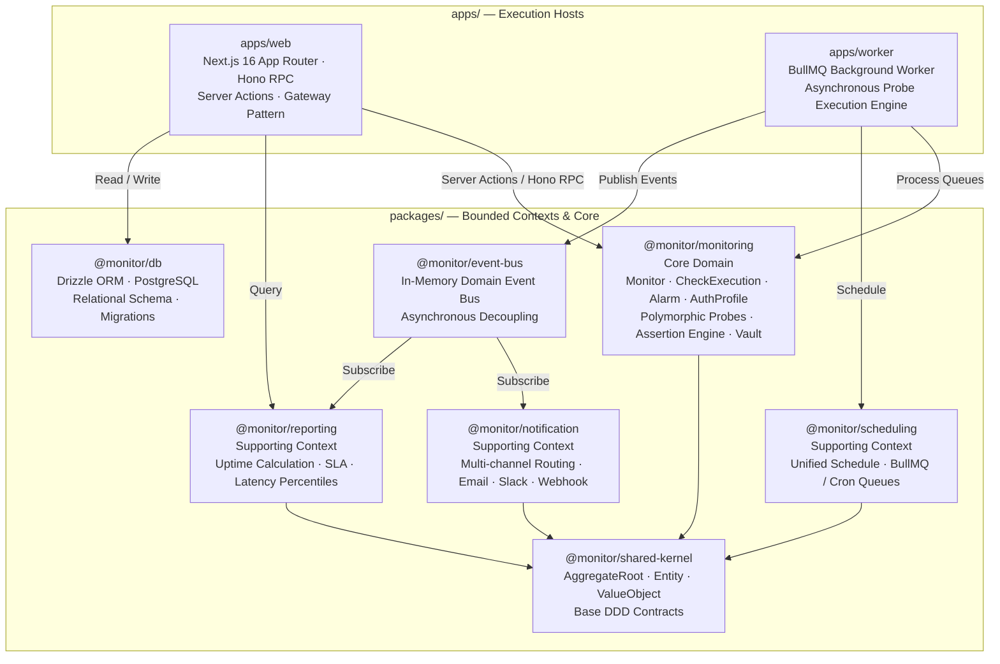
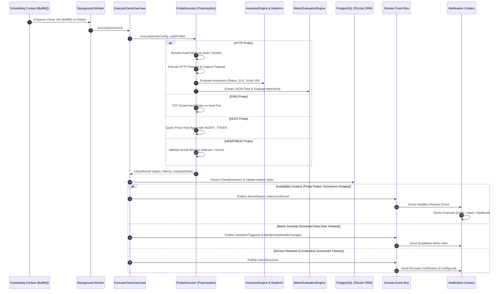

# Architecture & Domain-Driven Design Guide — SaaS API Monitor

This document serves as the official technical and architectural guide for the **SaaS API Monitor & Observability** platform. It details the system design decisions, software engineering patterns, **Domain-Driven Design (DDD)** practices, **Hexagonal Architecture (Ports & Adapters)** boundaries, polymorphic probe executors, the **Credential Vault**, and the frontend architecture powered by Next.js 16.

---

## Vision & Guiding Engineering Principles

The platform applies enterprise-grade architectural patterns to a distributed synthetic monitoring and alerting system:

1. **Domain Purity**: Pure business logic resides strictly within the core domain layer, free of dependencies on databases (Drizzle ORM), web frameworks (Next.js, Hono), or transport libraries.
2. **Hexagonal Architecture (Ports & Adapters)**: The domain defines abstract interfaces (Ports); infrastructure concerns (PostgreSQL, Redis, BullMQ, Resend, Slack) are implemented as swappable Adapters.
3. **Decoupled Asynchronous Communication (Event-Driven)**: Bounded Contexts never invoke each other synchronously or across hard boundaries. They interact exclusively by publishing and subscribing to **Domain Events**.
4. **Asynchronous Resilience**: Periodic probe execution is offloaded to an independent **Background Worker** process driven by BullMQ and Redis queues.
5. **Dual-Mode Architecture (Mock & Real)**: A frontend **Gateway Pattern** enables instantaneous in-memory execution with zero external dependencies, while supporting real production infrastructure (PostgreSQL + Redis).
6. **Defense-in-Depth Security**: AES-256-GCM symmetric encryption protects sensitive credentials at rest, and an isolated Node.js VM sandbox safely executes user-defined JavaScript assertion scripts.

---

## Bounded Context Architecture

The system is decomposed into autonomous, loosely coupled Bounded Contexts structured within a Turborepo monorepo:



### Context Responsibilities & Relationships

| Bounded Context | Nature | Architectural Role & Responsibilities |
|---|---|---|
| **`@monitor/monitoring`** | **Core Domain** | Models the life cycle of monitors, checks, alarms, credential profiles, and polymorphic probe engines (HTTP, TCP, Host Telemetry, Heartbeat). |
| **`@monitor/scheduling`** | **Supporting Context** | Manages recurring time execution rules, cron expressions, fixed intervals, and BullMQ queue orchestration. |
| **`@monitor/notification`** | **Supporting Context** | Multi-channel dispatching engine resolving recipients, rate-limiting notifications, and communicating with external delivery adapters (Resend, Slack). |
| **`@monitor/reporting`** | **Supporting Context** | Analytics and reporting engine aggregating uptime availability, SLA percentiles (P50, P95, P99), and downtime incidents over arbitrary time windows. |
| **`@monitor/shared-kernel`** | **Shared Kernel** | Foundational DDD building blocks (`AggregateRoot`, `Entity`, `ValueObject`, `DomainEvent`, `Result`). |
| **`@monitor/db`** | **Infrastructure** | Drizzle ORM schemas, migration runners, and PostgreSQL database clients. |
| **`@monitor/event-bus`** | **Infrastructure** | In-memory asynchronous pub/sub event bus decoupling contexts without network latency. |

---

## Polymorphic Probe Design Pattern

The monitoring engine implements a polymorphic architecture to support diverse probe types through unified Domain Ports:

```
                  ┌───────────────────────┐
                  │    ProbeExecutor      │
                  │    <<Domain Port>>    │
                  └───────────▲───────────┘
                              │
     ┌────────────────────────┼────────────────────────┬────────────────────────┐
     │                        │                        │                        │
┌────┴───────────────┐ ┌──────┴──────────────┐ ┌──────┴──────────────┐ ┌───────┴──────────────┐
│  HttpProbeExecutor │ │  PingProbeExecutor  │ │  HostProbeExecutor  │ │HeartbeatProbeExecutor │
│   (HTTP/REST APIs) │ │ (TCP Socket Checks) │ │(Pulse Host Telemetry)││ (Push Dead-Man Switch)│
└────────────────────┘ └─────────────────────┘ └─────────────────────┘ └───────────────────────┘
```

### Supported Probe Types:

1. **HTTP / REST Probe (`HttpProbeExecutor`)**:
   - Executes outbound requests across standard methods (`GET`, `POST`, `PUT`, `DELETE`, `PATCH`, `HEAD`).
   - Supports custom headers, body payloads, and explicit timeouts.
   - Integrates with `CryptoVault` for secure authentication (Basic Auth, Bearer, OAuth2 Client Credentials).
   - Validates responses via the declarative `AssertionEngine` (status codes, maximum latency SLA, regex matching) and isolated JavaScript sandboxes.

2. **PING / TCP Socket Probe (`PingProbeExecutor`)**:
   - Establishes a raw TCP socket connection (`net.Socket`) to evaluate network-level reachability and service availability.
   - Tests arbitrary destination ports (e.g., PostgreSQL 5432, Redis 6379, SSH 22, SMTP 25/587).
   - Accurately measures TCP handshake time in milliseconds, detecting connection timeouts, network refusals, or host unreachability.

3. **HOST Telemetry Probe (`HostProbeExecutor`)**:
   - Queries the companion daemon **Pulse Host Agent** (`monitor-probe-collector`) running on target nodes.
   - Communicates over authenticated HTTP with a shared cryptographic Bearer token (`AGENT_TOKEN`).
   - Collects real-time hardware telemetry: CPU utilization percentage, total/used/free RAM memory, and mounted disk volume capacity.

4. **HEARTBEAT Probe (`HeartbeatProbeExecutor`)**:
   - Implements passive, inbound monitoring ("dead man's switch") for recurring tasks and background jobs.
   - Evaluates whether external processes pinged their assigned unique token within an `expectedIntervalSeconds` plus a configurable `gracePeriodSeconds`.
   - Triggers automated incident workflows if an expected heartbeat does not arrive on schedule.

---

## Credential Vault & Authentication Security

Authentication secrets are safeguarded using cryptographic domain services and hardware-grade symmetric encryption:

```
┌────────────────────────────────────────────────────────────────────────┐
│                        CREDENTIAL VAULT DOMAIN                         │
│                                                                        │
│   ┌─────────────────────┐   AES-256-GCM       ┌───────────────────────┐│
│   │     AuthProfile     │  ─────────────►     │      CryptoVault      ││
│   │     (Aggregate)     │                     │   (Domain Service)    ││
│   │                     │  ◄─────────────     │                       ││
│   │ - profileType       │   Decryption        │ - 256-bit Secret Key  ││
│   │ - encryptedPayload  │                     │ - 12-byte random IV   ││
│   └─────────────────────┘                     │ - 16-byte auth tag    ││
│                                               └───────────────────────┘│
│                                                           ▲            │
│                                                           │            │
│                                               ┌───────────┴───────────┐│
│                                               │   AuthTokenManager    ││
│                                               │   (Domain Service)    ││
│                                               │                       ││
│                                               │ - Pre-flight Login    ││
│                                               │ - OAuth2 Auto-Refresh ││
│                                               │ - In-Memory Caching   ││
│                                               │ - Token TTL Rotation  ││
│                                               │└───────────────────────┘│
└────────────────────────────────────────────────────────────────────────┘
```

### 1. Symmetric AES-256-GCM Encryption
- **Integrity & Confidentiality**: Secrets are never persisted in plaintext. They are encrypted using **AES-256-GCM** (Authenticated Encryption with Associated Data).
- **Cryptographic Primitives**:
  - `ENCRYPTION_KEY`: 256-bit symmetric key represented as a 64-character hexadecimal string, injected via environment variables.
  - **Initialization Vector (IV)**: Generated as a 12-byte cryptographically secure random buffer for each encryption operation, preventing pattern analysis attacks.
  - **Authentication Tag**: 16-byte authentication tag ensuring payload tamper resistance at rest.

### 2. Token Lifecycle & OAuth2 Management (`AuthTokenManager`)
- **OAuth2 Client Credentials Flow**: For endpoints requiring temporary access tokens, the manager performs pre-flight authentication requests against the provider's `tokenUrl`.
- **Transparent Caching with TTL**: Tokens are cached in-memory until shortly before natural expiration (e.g., `expires_in - 30s`).
- **Automated Rotation**: As expiration approaches, `AuthTokenManager` renews the token transparently, eliminating network overhead on every individual check.

---

## Frontend Architecture (Next.js 16 & Gateway Pattern)

The web user interface is built on **Next.js 16 (App Router)** and follows strict separation of presentation and backend logic.

### 1. App Router Route Hierarchy (`/[dashboardId]/...`)
The UI is organized around operational Dashboards:
```
apps/web/app/
├── [dashboardId]/
│   ├── page.tsx                    # Dashboard overview with fleet metrics
│   ├── alarms/page.tsx             # Active incident center & resolution history
│   ├── credentials/page.tsx        # Credential Vault profile management
│   ├── monitors/
│   │   ├── new/page.tsx            # Polymorphic monitor creation modal
│   │   ├── [id]/page.tsx           # Individual monitor inspection, SLAs, latency charts
│   │   └── [id]/edit/page.tsx      # Monitor configuration editor
│   ├── recipients/page.tsx         # Notification recipient & channel settings
│   └── reports/
│       ├── page.tsx                # Historical SLA reports archive & report generator
│       └── [id]/page.tsx           # Report preview and detail view
├── api/
│   └── [[...route]]/route.ts       # Hono RPC typed endpoint handlers
└── layout.tsx                      # Root layout with responsive navigation shell
```

### 2. The Gateway Pattern (Mock vs. Real)
To accelerate frontend iteration and enable instant live demonstrations without infrastructure, the UI consumes domain data through **Gateway Ports**:
- **Gateway Interfaces**: Define typed read/write contracts (`DashboardGateway`, `MonitorGateway`, `AlarmGateway`, `ReportGateway`).
- **`MockGateway` (Mock Mode)**: In-memory adapter with realistic synthetic seed data and local mutations. Active when `NEXT_PUBLIC_USE_MOCK=true`. Requires no PostgreSQL, Redis, or Docker.
- **`HttpGateway` (Real Mode)**: Production adapter interacting directly with PostgreSQL and backend application use cases.
- **Transparent Factory**: Components invoke `getGateway()`, which returns the appropriate adapter at runtime without modifying React component code.

### 3. CQRS Separation in the Web Layer
- **Mutations (Writes)**: Handled via **Next.js Server Actions** (`features/*/actions/...`). Input data is validated against strict **Zod** schemas; the Server Action then orchestrates the use case and triggers UI revalidation via `revalidatePath`.
- **Queries (Reads)**: Handled via **Hono RPC** routes (`/api/...`) or direct invocation of Server Components, ensuring minimal time-to-first-byte and progressive streaming.

---

## Execution Flow & Event Lifecycle

The end-to-end lifecycle from scheduled dispatch to multi-channel incident notification:



---

## Domain Invariants & Business Rules

- **Cross-Field Validation**: A monitor of type `PING` cannot define a `DataExtractor` (raw TCP socket handshakes do not carry application-layer JSON payloads).
- **Sandboxed Isolation**: Custom JavaScript validation scripts execute in an ephemeral Node.js VM context with a strict execution deadline. If a script times out or raises an unhandled exception, the check is marked as `DOWN` with execution error details.
- **Allowed State Transitions**:
  ```
  PENDING  ──► UP | DOWN | DEGRADED
  UP       ──► DOWN | DEGRADED | PAUSED
  DOWN     ──► UP | DEGRADED | PAUSED
  DEGRADED ──► UP | DOWN | PAUSED
  PAUSED   ──► PENDING (resuming triggers a fresh evaluation cycle)
  ```
- **Alarm Confirmation Policies**: An incident in the `OPEN` state does not trigger immediate notifications unless configured with `consecutiveFailures: 1`. This prevents transient network blips from spamming on-call teams.
- **Notification Idempotency**: Resolving an incident (`RESOLVED`) triggers a recovery alert only if the alarm previously transitioned through the `NOTIFIED` state and the monitor's `recoveryNotificationEnabled` flag is active.
